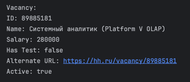

# Итоговый проект

https://github.com/hhru/api?tab=readme-ov-file дока

Получает с api.hh все актуальный вакансии, в которых упоминается язык scala
Также сохраняет вакансии в бд и поддерживает актуальность вакансии, т.е.
проверяет активна ли вакансия на данный момент или нет.

Поднимается локальный сервер, к которому можно сделать запросы:

1. **Приветственный запрос:**
    - **URL:** `/hello`
    - **Метод:** GET

2. **Получение информации о вакансиях:**
    - **URL:** `/vacancies`
    - **Метод:** GET

3. **Обновление вакансий:**
    - **URL:** `/vacancies/update`
    - **Метод:** POST

4. **Поиск вакансий по уровню заработной платы:**
    - **URL:** `/vacancies/search/salary`
    - **Метод:** GET
    - **Параметры запроса:**
        - `minSalary` (тип: Int)
        - `maxSalary` (тип: Int)
    - **Пример:** `/vacancies/search/salary?minSalary=50000&maxSalary=80000`

5. **Поиск вакансий, требующих тестирования:**
    - **URL:** `/vacancies/search/test`
    - **Метод:** GET
    - **Параметры запроса:**
        - `test` (тип: Boolean)
    - **Пример:** `/vacancies/search/test?test=true`

6. **Комбинированный поиск вакансий по критериям:**
    - **URL:** `/vacancies/search/criteria`
    - **Метод:** GET
    - **Параметры запроса:**
        - `minSalary` (тип: Int)
        - `maxSalary` (тип: Int)
        - `test` (тип: Boolean)
    - **Пример:** `/vacancies/search/criteria?minSalary=50000&maxSalary=80000&test=true`

Также тесты выполняются на пайплайнах в гитлабе

- Использование функциональной парадигмы (никаких `var`, `return`, циклов `while`), использование IO-монады для описания вычислений.
- Соблюдение нефункциональных требований к коду - покрытие тестами, настроенный CI/CD пайплайн.
- В рамках проекта необходимо использование СУБД PostgreSQL и интеграция с внешним сервисом. Например, с открытым API (REST, gRPC, etc.) или парсинг веб-страниц.
